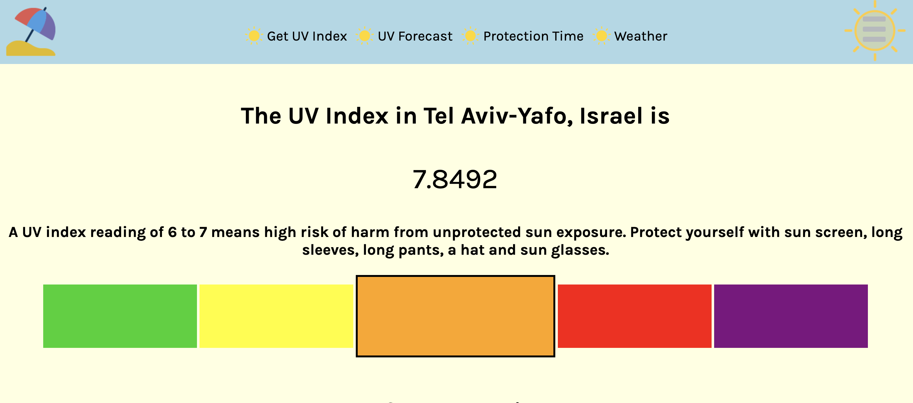

Description

'Beach or Basement' helps users to find the best time for outside activities regarding the UV index. 
The UV index measures the strength of ultraviolet (UV) radiation, which causes sunburn, skin damages, and skin cancer.

Motivation
A few years ago I moved to a permanently hot and sunny country. So I experienced first hand how sun exposure can affect your health and especially your skin negatively. That is why I think it is very important to plan outside activities with the UV index in mind. Going to the beach or exercise outside one hour earlier or later can make a huge difference. In contrast to usual weather apps, the UV app provides an hourly forecast of the UV index and a time in which it is safe, or safer to be in the sun.

Features

The App consists of four basic functions:

1. Start page/result page: The user enters her/his location the app returns the current UV index for the entered location, the safe exposure time (how long the user can stay in the sun without skin damage is caused)
2. Protection time: returns the time in which the UV index is higher than 3.5. If the UV index is over 3.5 it is not recommended to be exposed to the sun without protection.
3. UV forecast: returns the hourly UV index for the next day. If the UV index is over 3.5 the numbers are marked in red.
4. Weather: returns the current weather at the given location.
5. The app also provides links to further information on the UV index itself, skin types classification and a test to determine your skin type

1.1 Start page:

 

1.2 Result page 1:

1.3. Result page 2:

2. Protection time:

3. UV forecast:

4. Weather:

5. Links to further information: 

Built with:

Open UV API
Google Geocoding API

HTML
CSS
JS
jQuery

Demo: 

https://kirstenlisa.github.io/UV-Index-App/

